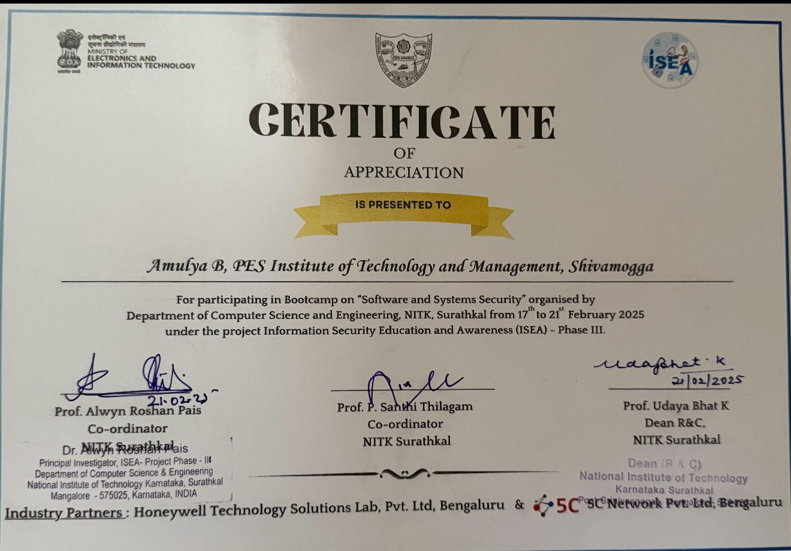

# Cyber Knowledge Graph – Bootcamp Project

This repository contains the project files and certificate from the Bootcamp on **"Software and Systems Security"** conducted by **NITK Surathkal** from **17th to 21st February 2025**, under the **Information Security Education and Awareness (ISEA) – Phase III** initiative supported by the Ministry of Electronics and Information Technology, Government of India.

## Certificate

## Project Description
> Add a 2-3 line summary of what your project does. (I can help write this if needed.)

## Industry Partners
- Honeywell Technology Solutions Lab Pvt. Ltd.
- 5C Network Pvt. Ltd.
